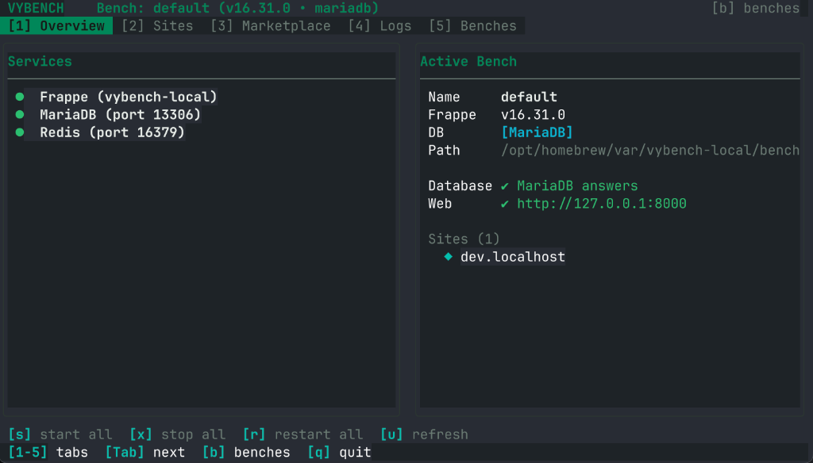
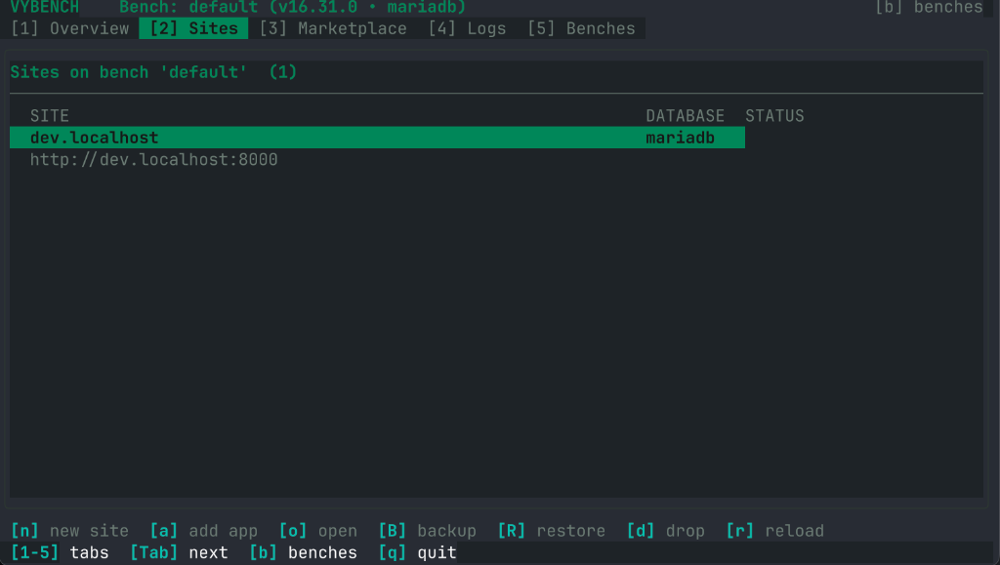
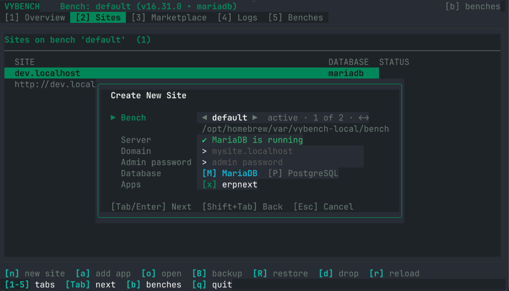
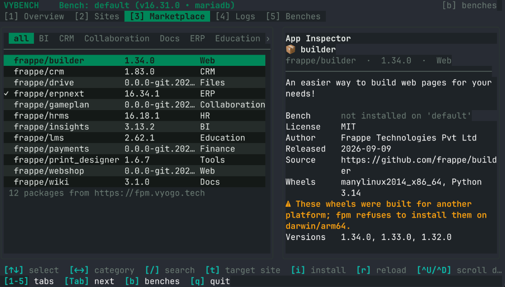
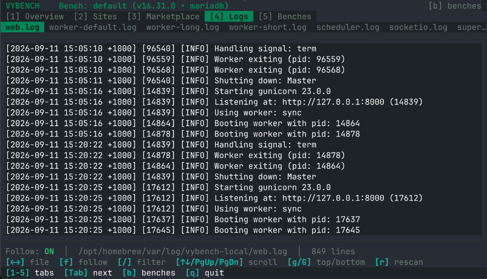
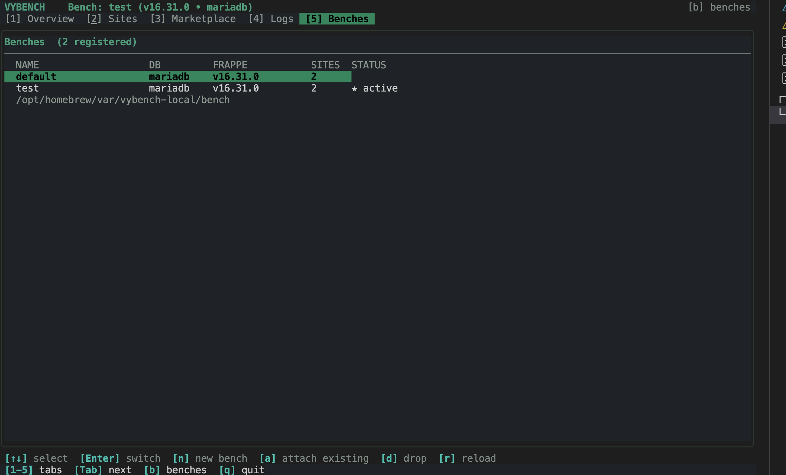

# vybench

**Frappe Multi-Bench Manager, Interactive TUI & ERPNext Distribution — Linux & macOS**

`vybench` packages Frappe, ERPNext, Python 3.14, Node.js 24, Redis 7, MariaDB 11.8, Nginx, and `wkhtmltopdf` into a single-node stack with an interactive Terminal User Interface (TUI), multi-bench management, and FPM app installation. PostgreSQL 16 is supported per bench and per site when a PostgreSQL server is available: the separate `vypgbench` snap on Linux, or `postgresql@16` from Homebrew on macOS.

Works out-of-the-box on **Ubuntu**, **Debian**, **Fedora**, **Arch**, **RHEL**, and any Linux distribution running `snapd`, and on **macOS** (Apple Silicon & Intel) via Homebrew.

---

## Highlights

- 🖥️ **Interactive Terminal UI (`vybench tui`)**: Full-screen console with service status and controls, site management, log tailing, bench switching, and an app marketplace.
- 📦 **FPM App Marketplace**: Browse the [fpm registry](https://fpm.vyogo.tech), inspect a package, and install it into the bench, and optionally onto a site, from a prebuilt package with no asset compilation. The published packages are built for Linux x86_64 today; on other platforms the TUI marks them and fpm declines to install them.
- 🔀 **Multi-Bench Orchestration (`vybench bench`)**: Create, attach, and switch between isolated benches on one machine.
- 🎯 **Other Frappe Versions**: A bench on the packaged Frappe release is ready in seconds. Other versions (`15`, `develop`, a tag or a branch) are built with `bench init`, which needs network access and a Python and Node that the release supports.
- 🗄️ **MariaDB or PostgreSQL**: Chosen per bench and per site. MariaDB ships in every package; PostgreSQL needs a PostgreSQL 16 server (see [Databases](#databases)).
- 🛡️ **Backward Compatible**: An existing single-bench install becomes the `default` bench on first use, with its Redis queues namespaced by `bench_id`.

---

## Interactive TUI (`vybench tui`)

Launch it with `vybench tui`, or run `vybench` with no arguments in a terminal. On the snap, use `vybench.tui`.

<!-- SCREENSHOT: Interactive TUI Overview dashboard with live service metrics and status -->


```
 VYBENCH    Bench: default (v16.34.1 • mariadb)                                         [b] benches
 [1] Overview  [2] Sites  [3] Marketplace  [4] Logs  [5] Benches
╭─────────────────────────────────────────────────────╮ ╭──────────────────────────────────────────╮
│  all  BI  CRM  Collaboration  Docs  ERP  Education ›│ │App Inspector                             │
│─────────────────────────────────────────────────────│ │📦 crm                                    │
│  frappe/builder        1.34.0         Web           │ │frappe/crm  ·  1.83.0  ·  CRM             │
│  frappe/crm            1.83.0         CRM           │ │───────────────────────────────────────── │
│  frappe/drive          0.0.0-git.202… Files         │ │Kick-ass Open Source CRM                  │
│✓ frappe/erpnext        16.34.1        ERP           │ │                                          │
│  frappe/hrms           16.18.1        HR            │ │Bench      not installed on 'default'     │
│  frappe/insights       3.13.2         BI            │ │License    AGPLv3                         │
│  frappe/lms            2.62.1         Education     │ │Released   2026-09-04                     │
│  frappe/print_designer 1.6.7          Tools         │ │Source     https://github.com/frappe/crm  │
│  frappe/wiki           3.1.0          Docs          │ │Wheels     manylinux2014_x86_64, Python   │
│ 12 packages from https://fpm.vyogo.tech             │ │           3.14                           │
│                                                     │ │Install into the bench only  [t] change   │
│                                                     │ │[i] Install frappe/crm==1.83.0            │
╰─────────────────────────────────────────────────────╯ ╰──────────────────────────────────────────╯
 [↑↓] select  [←→] category  [/] search  [t] target site  [i] install  [r] reload
 [1-5] tabs  [Tab] next  [b] benches  [q] quit
```

### Key Views

1. **[1] Overview**: Service status from the platform's service manager (`brew services`, `snapctl`, or systemd), refreshed every few seconds. `[s]` start all, `[x]` stop all, `[r]` restart all. Stop and restart leave the databases running.

2. **[2] Sites**: The sites of the active bench. `[n]` creates a site on the active bench or any other registered bench, `[o]` opens it in a browser, `[B]` backs it up with its files, `[R]` restores a backup, and `[d]` drops it after you type its name.
   - Before creating, restoring or dropping, the TUI checks that the database server is running, and `Ctrl+S` starts it if it is not.
   - A name that is taken is checked: a site left over from a failed `bench new-site` is replaced in place when you create it again, while a working site is only replaced with **Force** switched on, after a backup.
   - Restore picks one of the site's backups or any `.sql.gz` file, into the same site or a new one. **Force** allows a backup from an older Frappe version.

   <!-- SCREENSHOT: Sites view showing site health, quick actions (backup, restore, drop) -->
   

   <!-- SCREENSHOT: Modal dialog for creating a new site with database and app selection -->
   

3. **[3] Marketplace**: Packages from fpm.vyogo.tech. `[←→]` picks a category, `[/]` searches, `[t]` chooses a site to install onto, and `[i]` installs. The inspector shows the license, dependencies and supported Frappe versions. It warns when a package's wheels were built for another platform, because fpm refuses to install those.

   <!-- SCREENSHOT: FPM App Marketplace view with inspector details and category filter -->
   

4. **[4] Logs**: Tails the `.log` files of the active bench and, on Homebrew, the service logs. `[←→]` picks a file, `[f]` toggles follow, and `[/]` filters. Snap and systemd services log to the journal instead.

   <!-- SCREENSHOT: Real-time logs streaming view with search filtering -->
   

5. **[5] Benches**: `[Enter]` switches, `[n]` creates, `[a]` attaches an existing bench directory, and `[d]` removes a bench from the registry.

   <!-- SCREENSHOT: Multi-bench orchestration view showing registered benches and versioning -->
   

Long-running actions stream their output in a window: creating a site or bench, installing an app, or starting services. `[x]` cancels, and `[Esc]` closes the window when it is done. Global keys: `[1]`–`[5]` or `[Tab]` switch tabs, `[b]` opens Benches, and `[q]` quits.

---

## Multi-Bench Management

```bash
# List benches (* marks the active one)
vybench bench list

# Show the active bench, and why it is active
vybench bench current

# Make <name> the active bench for every shell and the services
vybench bench switch <name>

# Create a bench
vybench bench new <name> [--db mariadb|postgres] [--version VER] [--python PATH] [--switch=false]

# Register an existing bench directory
vybench bench attach <name> <path>

# Remove a bench from the registry (its files are kept)
vybench bench drop <name>
```

Switching repoints the `current-bench` symlink. Running services keep serving the previous bench until you restart them with `vybench restart`, or `[r]` in the TUI. A shell whose current directory is a bench, or that sets `VYBENCH_BENCH`, stays on that bench, and `vybench bench current` says so.

The registry, `benches.json`, sits next to the `current-bench` symlink in the vybench data directory: `$(brew --prefix)/var/vybench`, or `/var/snap/vybench/common` on the snap. That snap directory belongs to root, so run bench management there with `sudo`.

### Frappe Versions

Without `--version`, `vybench bench new` uses the Frappe release that ships with the package. Its `apps/` and `env/` are linked from the package, so the bench is ready in seconds.

Any other version is built with `bench init`:

```bash
# The packaged release: linked, ready in seconds
vybench bench new erp

# Frappe 15, built with: bench init --frappe-branch version-15
vybench bench new erp-v15 --version 15

# The develop branch, or any tag or branch of frappe
vybench bench new erp-dev --version develop
```

`bench init` downloads Frappe and its Python and Node dependencies, which takes several minutes. It uses the bundled Python 3.14 unless you pass `--python`, and an older Frappe release may need an older Python. If the build fails or you press Ctrl+C, the half-built directory is removed.

`vybench` detects each bench's version from:
- `apps/frappe/frappe/__init__.py` (`__version__`)
- `apps/frappe/.git` branch
- `sites/common_site_config.json`
- Python `dist-info/METADATA`

### Databases

Each bench and site chooses MariaDB or PostgreSQL: `--db` for a bench, `--db-type` for `bench new-site`.
- **MariaDB 11.8** ships in the Homebrew formula and the `vybench` snap. The TUI and `vybench bench new-site` supply its root credentials for you. On macOS, vybench's MariaDB listens on its own socket and port 13306, and its Redis on port 16379, next to any MariaDB or Redis you already run on 3306 and 6379. Set `VYBENCH_DB_PORT` or `VYBENCH_REDIS_PORT` to use other ports.
- **PostgreSQL 16** needs a server listening on `127.0.0.1:5432`. On macOS, run `brew install postgresql@16 && brew services start postgresql@16`. On Linux, install the `vypgbench` snap, which runs PostgreSQL in place of MariaDB. A new PostgreSQL site asks for the superuser name and password.

---

## Quick Start

### macOS (Homebrew)

```bash
# Add the vybench tap
brew tap vyogotech/tap

# Install vybench (builds from source — takes ~10 min on first install)
brew install vybench

# Start vybench. It runs its own MariaDB (port 13306) and Redis (port 16379),
# so Homebrew's mariadb and redis services are not used and can keep running.
vybench start

# Launch interactive TUI
vybench tui

# Or create your first site via CLI
vybench bench new-site mysite.localhost --admin-password admin
echo "127.0.0.1 mysite.localhost" | sudo tee -a /etc/hosts
# → Open http://mysite.localhost:8000
```

Uninstall:
```bash
brew services stop vybench
brew uninstall vybench
```

### Linux (Snap)

Install from the Snap Store:
```bash
sudo snap install vybench
```

Or install a locally built `.snap` package:
```bash
sudo snap install --dangerous vybench_16.0.0_amd64.snap
```

Remove the package and purge all associated services and runtime data:
```bash
sudo snap remove --purge vybench
```

---

## Operating Modes

`vybench` supports two operational modes: **Production** and **Developer**.

### 1. Production Mode (Default)
In production mode, systemd daemons (`web`, `worker`, `mariadb`, `redis`, `scheduler`, `socketio`) run continuously in the background as the unprivileged `snap_daemon` account. The codebase remains read-only for maximum stability.

```bash
sudo snap set vybench mode=production
```

### 2. Developer Mode
In developer mode, managed app services are disabled and the `apps/` and `env/` virtual environments are materialised into the active bench as real, writable directories. This enables live code editing, `git pull`, `pip install`, `bench get-app`, `bench new-app`, and `bench build`.

```bash
sudo snap set vybench mode=developer
```

---

## User Permissions & CLI Usage

### Granting Access (No `sudo` Required)
To run `vybench.bench` as your normal host user without `sudo`, add your user account to the `snap_daemon` group:

```bash
sudo usermod -aG snap_daemon $USER
newgrp snap_daemon
```

### Managing Sites & Apps

> **Note for Snap users:** Commands below use `vybench bench`. On Snap, use `vybench.bench` or run `sudo snap alias vybench.bench bench` to use `bench` directly.

```bash
# Create a new development site
vybench bench new-site dev.localhost --admin-password admin

# Enable developer_mode (enables DocType editing, custom fields, live reloads)
vybench bench --site dev.localhost set-config developer_mode 1

# Map local hostname to loopback
echo "127.0.0.1 dev.localhost" | sudo tee -a /etc/hosts
```

---

## Developer Workflow & CLI Cheatsheet

### 1. App Development (Custom Apps & Git)

```bash
# Scaffold a brand new custom Frappe app
vybench bench new-app my_custom_app

# Clone an existing app repository from Git into apps/
vybench bench get-app https://github.com/frappe/hrms.git --branch version-16

# Install an app onto your site
vybench bench --site dev.localhost install-app hrms

# List all apps installed on the site
vybench bench --site dev.localhost list-apps

# Uninstall an app from the site (keeps app source in apps/)
vybench bench --site dev.localhost uninstall-app hrms
```

### 2. Frontend Assets & Watch Mode

```bash
# Watch mode: automatically rebuild frontend bundles when TypeScript / Vue / CSS changes
vybench bench watch

# Build frontend bundles for production or after pulling updates
vybench bench --site dev.localhost build --app my_custom_app

# Build assets for all installed apps
vybench bench --site dev.localhost build
```

### 3. Migrations & Cache Invalidation

```bash
# Run database schema migrations (DocType changes, patches)
vybench bench --site dev.localhost migrate

# Clear Redis cache and reset Frappe document metadata cache
vybench bench --site dev.localhost clear-cache
```

### 4. Interactive Debugging & Shells

```bash
# Open interactive Python REPL with the active site and Frappe context loaded
vybench bench --site dev.localhost console

# Open MariaDB client directly connected to the site database
vybench bench --site dev.localhost mariadb

# Open root MariaDB client (macOS: dedicated port 13306, socket-managed)
vybench mysql

# Open Redis interactive CLI (macOS: dedicated port 16379)
vybench redis-cli
```

### 5. Automated Testing

```bash
# Run unit tests for an app
vybench bench --site dev.localhost run-tests --app my_custom_app

# Run a specific test module
vybench bench --site dev.localhost run-tests --module my_custom_app.tests.test_api

# Run tests with doctype test records
vybench bench --site dev.localhost run-tests --app my_custom_app --doctype "Task"
```

### 6. Snapshots, Backups & Restoration

```bash
# Create complete snapshot backup (database + private & public files)
vybench bench --site dev.localhost backup --with-files

# Restore database from backup archive
vybench bench --site dev.localhost restore /path/to/backup.sql.gz \
  --with-public-files /path/to/public-files.tar \
  --with-private-files /path/to/private-files.tar
```

### 7. Instant App Installs via FPM (Zero Compilation)

[FPM (Frappe Package Manager)](https://fpm.vyogo.tech) provides prebuilt binary packages:

```bash
# Download and install precompiled app wheels and assets directly into the bench
fpm install frappe/crm==1.83.0

# Install onto site (no build/compile step needed)
vybench bench --site dev.localhost install-app crm
```

---

## Service Controls & Diagnostics

### macOS (Homebrew)

vybench manages its own isolated MariaDB (port 13306) and Redis (port 16379), completely independent of standard Homebrew services on ports 3306 and 6379.

```bash
# Check service status and port connectivity
vybench status

# Start, stop, or restart the supervisor and stack
vybench start
vybench stop
vybench restart

# Tail live application and worker logs
vybench logs web              # Gunicorn web workers
vybench logs worker-default   # Background job workers
vybench logs scheduler        # Periodic tasks
vybench logs socketio         # Realtime WebSocket server
```

### Linux (Snap)

```bash
# Check service status
sudo snap services vybench

# Restart all vybench services
sudo snap restart vybench

# Restart a specific daemon (e.g. gunicorn web server)
sudo snap restart vybench.web

# Tail live service logs
sudo snap logs -f vybench.web
```

---

## Building & Testing

### Interactive TUI Binary
```bash
make tui
# Compiles to brew/bin/vybench-tui, where brew/bin/vybench finds it
```

### Unit Tests
```bash
make tui-test   # go vet + go test -race
```

### macOS — Homebrew Formula
```bash
# Build from current source tree and test install locally
make brew-local-test

# Install from remote tap formula (first install, ~10 min)
make brew

# Audit formula style and correctness
make brew-audit

# Run formula test block
make brew-test
```

### Linux — Container & Native Package Testing
```bash
# Run fast automated package test in an isolated Podman/Docker container
./scripts/test-packaging-fast.sh ubuntu-24.04
./scripts/test-packaging-fast.sh debian-12
```

### Linux — Local Snap Build
To build the snap package locally using `snapcraft`:

```bash
# Build the snap package
snapcraft

# Or build in destructive-mode inside a dedicated VM / container
snapcraft --destructive-mode
```

---

## Documentation

* [Developer Cheatsheet](docs/developer-cheatsheet.md)
* [Architectural Comparison (Vybench vs. Host Scripts vs. Docker)](docs/comparison.md)
* [Linux Snap Installation Guide](docs/snap-install.md)
* [Native .deb / .rpm Installation Guide](docs/native-install.md)

---

## CI/CD Pipeline

Continuous Integration is managed via `.github/workflows/ci.yml`:
* **Fast Tier (~1 min):** Validates shell syntax, YAML schemas, JSON configs, and Nginx template drift.
* **Slow Tier:** Automatically builds packages and runs full integration tests on **Ubuntu 24.04** and **Debian 12**.

---

## Licensing & Terms

* **vybench Packaging & Orchestration Tools:** Copyright (c) 2026 Vyogo Technologies. All Rights Reserved.  
  *Source-Available License (No Derivatives):* Source code is publicly viewable for inspection and verification. Inspection and evaluation are permitted; modification, creation of derivative works, re-branding, or hosting modified forks without prior written authorization from Vyogo Technologies is strictly prohibited. See [LICENSE](LICENSE) for details.
* **Frappe Framework:** MIT License
* **ERPNext:** GPL-3.0 License (shipped as unmodified upstream source inside `apps/erpnext`)
